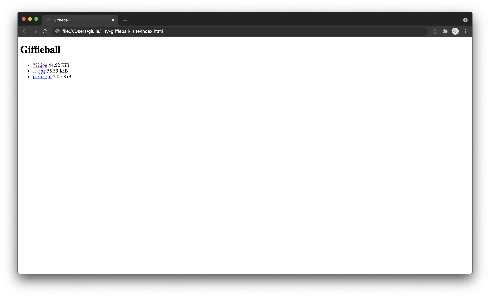

# 11ty Giffleball

Basic 11ty app from tutorial.

| \                | \                                                                                                                                                                                                               |
|------------------|-----------------------------------------------------------------------------------------------------------------------------------------------------------------------------------------------------------------|
| Deploy status    | /                                                                                                                                                                                                              |
| Deploy preview   | /                                                                                                                                                                                                               |
| Project typology | 📒  Step by step from tutorial [Making a Simple Web Site with the Simplest Static Site Generator](https://medium.com/@11ty/making-a-simple-web-site-with-the-simplest-static-site-generator-level-1-7fc6febca1) |




## 🔥 Tech stack

| Purpose               | Technology   |
|:----------------------|:-------------|
| Templating            | Liquid       |
| Styling               | SCSS + BEMIT |
| Documentation         | Markdown     |
| Static site generator | 11ty         |

## 🌊 Run development mode

Not available.

## 🧳 Build setup

```shell
# install dependencies
npm i

# generate static files in `_site` directory
npm run build
```

and then open `_site/index.html` with your browser.

### 🌿 Branches

| Branch name | Use        |
|:------------|:-----------|
| `main`      | production |
